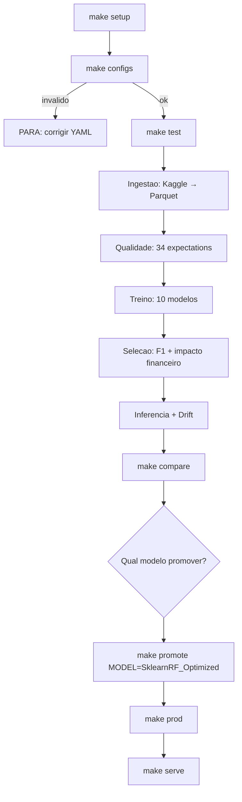
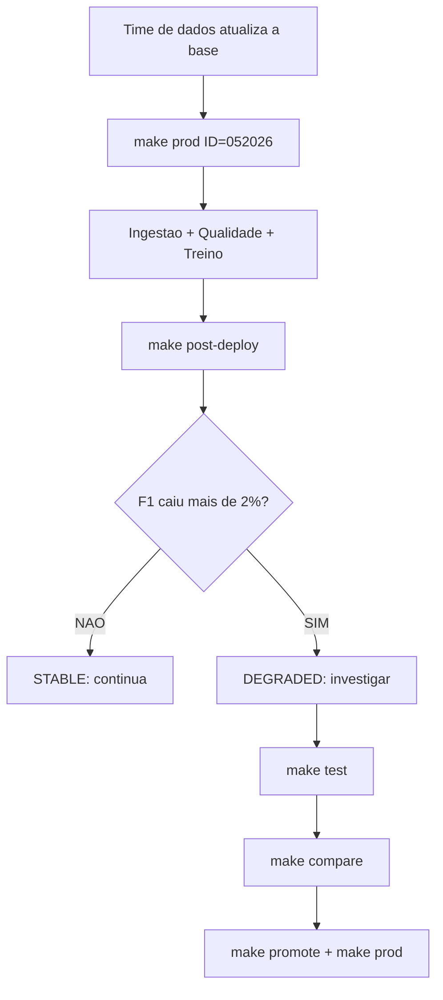
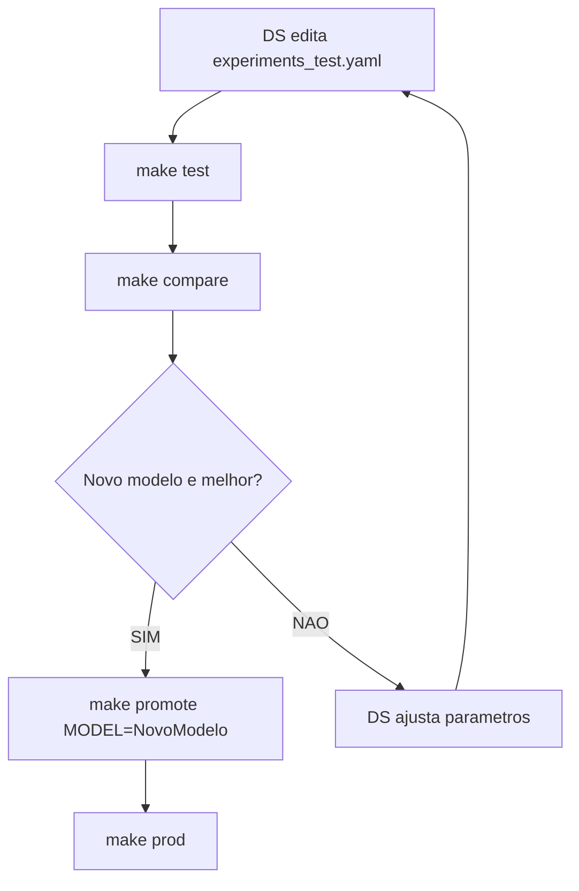
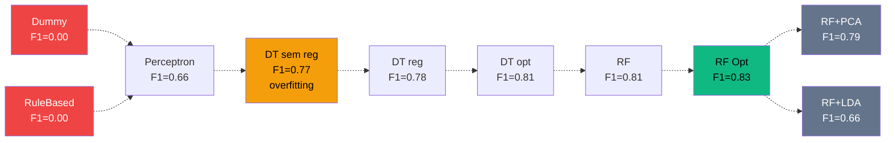
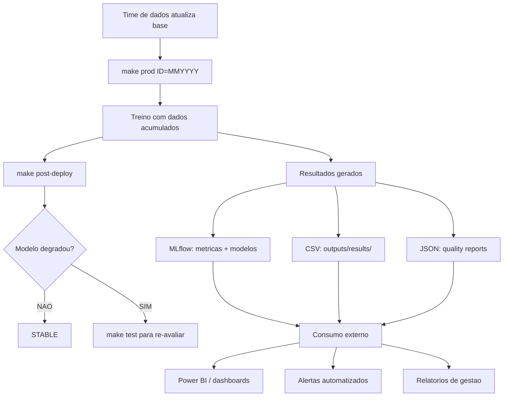

# Relatorio Tecnico - Operacionalizacao de Modelos com MLOps

**Disciplina:** Operacionalizacao de Modelos com MLOps
**Dataset:** Loan Approval Classification (45.000 registros, 13 features)

---

## 1. Introducao e Contexto

### Problema de negocio

Uma instituicao financeira recebe milhares de solicitacoes de emprestimo e precisa decidir quais aprovar e quais rejeitar. Cada decisao errada tem custo:

- **Falso Positivo (aprovar caloteiro):** o banco perde o valor do emprestimo.
- **Falso Negativo (rejeitar bom cliente):** o banco perde a receita de juros.

### Objetivo tecnico

Classificacao binaria: prever se uma solicitacao deve ser aprovada (1) ou rejeitada (0), usando 13 caracteristicas do solicitante e do emprestimo.

### Metricas de sucesso

- **Tecnica:** F1-Score, que equilibra nao aprovar caloteiros (precision) e nao perder bons clientes (recall). Usamos F1 em vez de accuracy porque o dataset e desbalanceado (78% rejeitados). Um modelo que rejeita todo mundo tem 78% de accuracy mas F1=0.
- **Negocio:** impacto financeiro total (custo dos erros em reais).

### Evolucao do projeto

No projeto anterior, exploramos diferentes modelos num notebook unico. Testamos Perceptron, Decision Trees e Random Forest, e identificamos que o Random Forest otimizado produzia o melhor resultado (F1=0.83).

Neste projeto, o desafio mudou: nao se trata mais de encontrar o melhor modelo, mas de estruturar o trabalho como um projeto de engenharia. Reorganizamos o notebook em scripts modulares, adicionamos configuracoes externas, tracking de experimentos, validacao de qualidade, e monitoramento, transformando uma exploracao pontual num sistema reprodutivel e operacional.

---

## 2. Estruturacao do Projeto

### De notebook para engenharia

No projeto anterior, toda a logica vivia num notebook de 89 celulas. Isso funciona para explorar, mas apresenta limitacoes para operacao. Neste projeto, cada responsabilidade tem seu modulo em `src/`, as configuracoes ficam em `config/` (YAML validado por dataclasses), e a execucao e feita via Makefile.

### Repositorio

```
config/                     Configuracoes (YAML)
  data.yaml                 Contrato de dados: colunas, tipos, fonte
  pipeline.yaml             Execucao: random_state, split, drift
  quality.yaml              34 regras de qualidade
  experiments_test.yaml     10 modelos para experimentacao
  experiments_prod.yaml     1 modelo para producao

src/                        Modulos do pipeline
  config.py                 Dataclasses que validam os YAMLs
  ingestion.py              Download + CSV → Parquet
  quality_checks.py         Validacao de qualidade
  preprocessing.py          RobustScaler + OneHotEncoder via ColumnTransformer
  train.py                  Treina modelos e registra no MLflow
  evaluate.py               Compara modelos e calcula impacto financeiro
  serve.py                  Servico de inferencia
  monitoring.py             Deteccao de drift

models/                     Modelos customizados (DS edita aqui)
  custom_models.py          RuleBasedClassifier (regras de negocio)

scripts/                    Ferramentas de apoio
  compare.py                Tabela comparativa no terminal + CSV
  promote.py                Promove modelo para producao
  post_deploy.py            Compara run atual vs anterior
```

### Workflows do pipeline

O pipeline opera em tres cenarios:

**Workflow 1: Primeiro deploy**



**Workflow 2: Execucao mensal**



**Workflow 3: Testar novo modelo**



### Workflow com dados reais: primeiro deploy executado

```mermaid
flowchart LR
    KAGGLE["Kaggle<br/>45k rows<br/>14 cols"]
    PARQUET["Parquet<br/>Snappy"]
    SCHEMA["Schema<br/>validado"]
    QUALITY["Quality<br/>33 ok, 1 falha"]
    PREPROC["Preprocessing<br/>22 features<br/>36k train / 9k test"]
    TRAIN["Treino<br/>10 modelos"]
    SELECT["Selecao<br/>RF_Optimized<br/>F1=0.83"]
    FINANCIAL["Financeiro<br/>R$2.1M"]
    PROMOTE["Promote<br/>experiments_prod.yaml"]
    PROD["Producao<br/>1 modelo"]
    SERVE["Inferencia<br/>ao vivo"]

    KAGGLE --> PARQUET --> SCHEMA --> QUALITY --> PREPROC --> TRAIN --> SELECT --> FINANCIAL --> PROMOTE --> PROD --> SERVE
```



Resultados do treino (10 modelos):



### Decisoes de configuracao

As configuracoes sao externas ao codigo, definidas em 5 arquivos YAML, cada um validado por uma dataclass Python. Campos obrigatorios geram erro imediato na carga. Campos opcionais tem valor padrao.

O pipeline opera em dois modos controlados por parametro: `make test` (experimentacao, 10 modelos) e `make prod` (producao, 1 modelo). Dados e relatorios ficam em pastas separadas por modo e execution_id, sem sobrescrita.

O Makefile funciona como CI/CD simulado. Em producao real, seriam etapas de GitHub Actions ou similar.

---

## 3. Fundacao de Dados

### Dataset

Loan Approval Classification (Kaggle): 45.000 solicitacoes de emprestimo com 14 colunas (8 numericas, 5 categoricas, 1 target). Desbalanceamento: 78% rejeitados, 22% aprovados.

### Ingestao e armazenamento

Dados baixados do Kaggle e convertidos para Parquet (compressao Snappy), um formato colunar mais eficiente que CSV. Neste projeto usamos armazenamento local. Em producao real, a escolha dependeria da infraestrutura (data warehouse, data lake, banco relacional).

### Contrato e qualidade

O `data.yaml` define quais colunas o pipeline espera. Na ingestao, o schema e validado. 34 regras de qualidade no `quality.yaml` verificam ranges, nulos e categorias antes de qualquer treino. Resultado: 33 ok, 1 falha (7 registros com idade > 100, outliers reais mantidos).

### Preprocessamento

RobustScaler para numericas (usa mediana, resistente a outliers de renda) e OneHotEncoder para categoricas (com drop='first' para evitar colunas redundantes). 13 colunas originais viram 22 apos encoding. O preprocessador aprende estatisticas apenas do treino para evitar vazamento de informacao.

---

## 4. Experimentacao

### Dois tipos de modelos

O pipeline aceita modelos sklearn (declarados no YAML, instanciados automaticamente) e modelos customizados (escritos em `models/custom_models.py`, com interface fit/predict). Ambos passam pelas mesmas etapas e sao registrados no MLflow.

### Resultados

| Modelo | Tipo | F1 | Overfitting | Tempo |
|--------|------|:---:|:---:|:---:|
| SklearnDummy | Baseline sklearn | 0.0000 | nenhum | 0.0s |
| CustomRuleBased | Baseline customizado | 0.0000 | nenhum | 0.0s |
| SklearnPerceptron | Linear | 0.6641 | nenhum | 0.0s |
| SklearnDT_NoRegularization | Arvore | 0.7722 | severo | 0.1s |
| SklearnDT_Regularized | Arvore | 0.7836 | nenhum | 0.1s |
| SklearnDT_Optimized | Arvore | 0.8055 | baixo | 5.4s |
| SklearnRandomForest | Ensemble | 0.8053 | baixo | 0.3s |
| **SklearnRF_Optimized** | **Ensemble** | **0.8254** | **aceitavel** | **38s** |
| SklearnRF_PCA | Ensemble + PCA | 0.7891 | alto | 3.3s |
| SklearnRF_LDA | Ensemble + LDA | 0.6643 | alto | 1.1s |

### Evolucao

Regras deterministicas (F1=0.00) → modelo linear (0.66) → arvore com overfitting (0.77) → arvore regularizada (0.78) → ensemble otimizado (0.83). Cada aumento de complexidade trouxe ganho mensuravel.

---

## 5. Reducao de Dimensionalidade

Testamos PCA (comprime features sem olhar rotulos) e LDA (comprime olhando rotulos). t-SNE descartado por nao ter `transform()`.

PCA reduziu de 22 para 17 features (95.4% variancia retida) mas perdeu 3.6 pontos de F1. LDA reduziu para 1 feature e perdeu 16 pontos. Com 22 features, dimensionalidade ja e gerenciavel. Reducao nao se justifica.

Testamos apenas no RF_Optimized (melhor modelo) porque se reducao nao melhora o melhor, nao vai melhorar os piores.

---

## 6. Selecao do Modelo Final

### Analise financeira

Cada erro tem custo calculado com valores reais do dataset:
- **FP:** soma(loan_amnt) dos caloteiros aprovados. Banco perde 100% do emprestimo.
- **FN:** soma(loan_amnt x loan_int_rate / 100) dos bons clientes rejeitados. Banco perde os juros.

| Modelo | FP | FN | Prejuizo FP | Receita Perdida FN | Impacto Total |
|--------|:---:|:---:|---:|---:|---:|
| SklearnRandomForest | 145 | 554 | R$1.46M | R$0.54M | R$2.0M |
| SklearnRF_Optimized | 176 | 471 | R$1.63M | R$0.47M | R$2.1M |
| SklearnDT_Optimized | 214 | 507 | R$1.94M | R$0.52M | R$2.5M |
| SklearnDummy | 0 | 2000 | R$0 | R$2.84M | R$2.8M |
| SklearnPerceptron | 261 | 876 | R$3.60M | R$0.83M | R$4.4M |
| SklearnRF_LDA | 646 | 684 | R$6.34M | R$0.74M | R$7.1M |

### Justificativa

RF Optimized selecionado: maior F1 (0.8254), AUC-ROC 0.975, diferenca de impacto financeiro pequena (R$100k vs RandomForest) compensada por recall superior (76.45% vs 72.30%, menos bons clientes rejeitados).

---

## 7. Operacionalizacao

### Inferencia

O servico (`make serve`) carrega o modelo de producao do MLflow, aplica o mesmo preprocessamento do treino, e retorna a decisao com probabilidade em tempo real. As 200 arvores do Random Forest votam para cada cliente.

### Monitoramento e drift

Comparacao de estatisticas (media) de cada feature entre treino e producao. Limiar configuravel (padrao 10%). Verifica tambem se categorias novas apareceram. Na simulacao, nenhum drift detectado (esperado com mesmo dataset).

### Execucao mensal e consumo de dados

A cada mes, o time de dados atualiza a base e o pipeline roda em producao. O fluxo completo:



Cada execucao gera tres tipos de output consumiveis:

| Output | Formato | Caminho | O que contem |
|--------|---------|---------|-------------|
| Metricas e modelos | SQLite | `mlflow.db` | F1, accuracy, precision, recall, AUC-ROC, tempo, parametros, modelos salvos por run |
| Comparativo | CSV | `outputs/results/comparison_*.csv` | Tabela com todos os modelos, metricas, execution_id |
| Qualidade | JSON | `outputs/quality_reports/{mode}/{id}/` | 34 expectations com passed/failed por execucao |

Sistemas como Power BI conectam no CSV ou consultam o SQLite diretamente. O `execution_id` (MMYYYY) permite filtrar a execucao mais recente. Os dados de producao ficam sempre na pasta `production/{execution_id}`, separados da experimentacao.

A decisao de negocio e: **o consumidor sempre le a ultima execucao.** Se o time de dados publicou dados de maio (052026), o Power BI filtra por `execution_id = 052026` e mostra as metricas daquela safra. O historico de execucoes anteriores fica preservado para comparacoes (ex: evolucao do F1 ao longo dos meses).

### Analise pos-deploy

O `make post-deploy` roda apos cada execucao mensal. Compara metricas da run atual com a anterior. Se F1 cair mais de 0.02, status DEGRADED e recomenda re-avaliar todos os modelos. Em producao real, esse alerta poderia ser integrado a sistemas de notificacao (Slack, email, PagerDuty).

### Ciclo mensal

1. Time de dados atualiza a base
2. `make prod` retrain com dados acumulados
3. `make post-deploy` compara com versao anterior
4. Se estavel, continua. Se degradou, `make test` re-avalia todos os modelos.

Retreino completo (nao incremental) porque queremos que o modelo aprenda todos os padroes historicos.

---

## 8. Decisoes tecnicas

| Decisao | Justificativa |
|---------|---------------|
| Scripts modulares | Reutilizaveis, testaveis, substituiveis independentemente |
| YAML + dataclasses | Configuracao externa com validacao de tipos |
| Dois tipos de modelo (sklearn + custom) | Flexibilidade para modelos prontos e logica especifica |
| RobustScaler | Dataset tem outliers significativos em renda |
| OneHotEncoder drop='first' | Evita colunas redundantes que confundem o modelo |
| PCA + LDA testados, nao usados | Reducao piorou F1. Decisao baseada em evidencia. |
| Reducao so no melhor modelo | Se nao melhora o melhor, nao melhora os piores |
| Parquet | Adequado ao escopo. Producao real: conforme infraestrutura. |
| SQLite para MLflow | Simples, local. Producao: PostgreSQL. |
| Retreino completo mensal | Preserva historico. scikit-learn treina rapido. |
| Makefile como CI/CD | Documenta e padroniza a execucao. Producao: GitHub Actions. |
| Dois experiments MLflow | Experimentacao nao impacta producao |
| execution_id por mes | Rastreabilidade. Sem sobrescrita. |

### O que mudaria em producao real

Armazenamento → banco de dados. Orquestracao → Airflow. Inferencia → API HTTP. Monitoramento → dashboard. Testes unitarios. CI/CD automatizado. Containers.

### Aprendizado

A principal mudanca neste projeto nao e tecnica, e de mentalidade. O foco deixa de ser maximizar uma metrica e passa a ser garantir que o sistema e reprodutivel, rastreavel, e preparado para mudancas. O modelo e uma peca de um sistema que precisa ser mantido, monitorado e atualizado continuamente.
