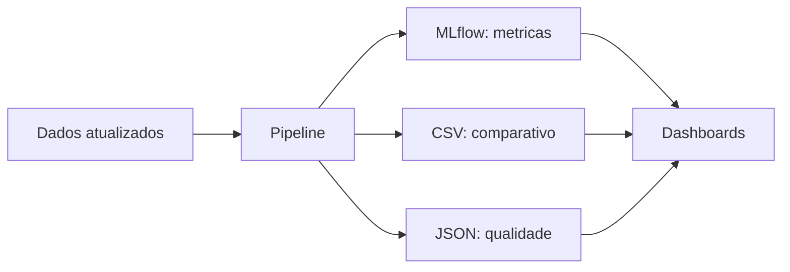
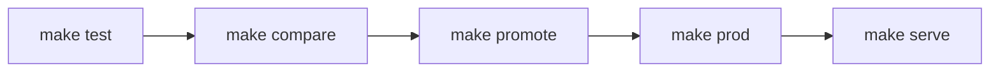
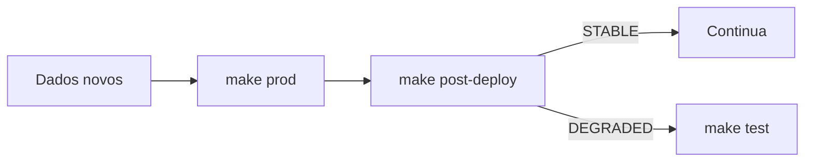
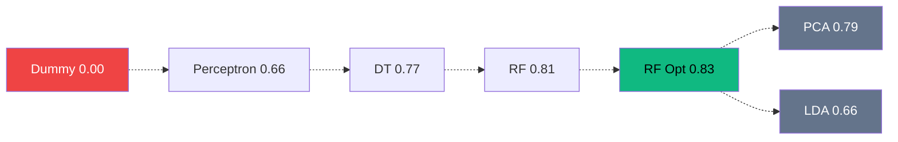

# Relatorio Tecnico: Operacionalizacao de Modelos de Machine Learning

**Disciplina:** Operacionalizacao de Modelos com MLOps
**Dataset:** Loan Approval Classification (45.000 registros, 13 features)

---

## 1. Contexto e Objetivo

Uma instituicao financeira processa milhares de solicitacoes de emprestimo. Cada decisao errada gera impacto financeiro direto: aprovar um cliente inadimplente significa perder o valor total emprestado; rejeitar um cliente adimplente significa perder a receita de juros.

No projeto anterior, exploramos diferentes abordagens de classificacao e identificamos o Random Forest otimizado como o modelo mais eficaz (F1=0.83). O trabalho tecnico de experimentacao estava concluido, porem nao operacionalizavel: o codigo vivia em um notebook monolitico, sem rastreabilidade de experimentos, sem validacao de dados de entrada, e sem separacao entre ambientes de teste e producao.

Este projeto tem como objetivo transformar esse trabalho em um sistema de engenharia: reprodutivel, rastreavel, monitoravel, e preparado para manutencao continua por um time.

As metricas de avaliacao foram definidas em dois niveis:
- **Tecnica:** F1-Score, que equilibra a capacidade de evitar inadimplentes aprovados (precision) e de nao rejeitar bons clientes (recall).
- **Negocio:** impacto financeiro total, calculado com valores reais do dataset (valor dos emprestimos e taxas de juros).

---

## 2. Diagnostico e Requisitos

### Diagnostico do estado anterior

O notebook do projeto anterior apresentava as seguintes limitacoes operacionais:

| Limitacao | Consequencia |
|-----------|-------------|
| Codigo monolitico (89 celulas) | Dificil de manter e revisar em equipe |
| Parametros embutidos no codigo | Qualquer alteracao exige editar scripts |
| Sem rastreabilidade | Resultados de execucoes anteriores sao perdidos |
| Sem validacao de entrada | Dados com problemas so sao detectados durante o treinamento |
| Sem separacao de ambientes | Testes de novos modelos impactam operacao |

### Por que operacionalizar

O modelo do projeto anterior funciona. O problema e que ele nao pode ser operado. Um notebook nao escala, nao e auditavel, e nao permite que diferentes pessoas contribuam de forma independente. Operacionalizar significa construir uma plataforma que transforma experimentacao em valor recorrente.

O que essa plataforma precisa permitir:

- **Experimentacao facilitada.** Um data scientist deve poder testar um modelo novo editando um arquivo de configuracao, sem depender de engenharia. O ciclo de teste precisa ser rapido: configurar, executar, comparar, decidir.
- **Deploy simplificado.** Promover um modelo de experimentacao para producao deve ser um comando, nao um processo manual de copiar arquivos e ajustar parametros.
- **Inclusao de novos modelos sem alterar o pipeline.** Tanto modelos prontos (scikit-learn) quanto logica customizada de negocio devem funcionar na mesma infraestrutura, com as mesmas metricas e rastreabilidade.
- **Monitoramento continuo.** O modelo em producao precisa ser acompanhado. Se os dados mudarem ou a performance degradar, o sistema deve alertar e facilitar a reavaliacao.
- **Resultados consumiveis.** Os outputs nao podem ficar presos no terminal. Dashboards, relatorios de gestao e sistemas de BI precisam consumir metricas e resultados de cada execucao.

### Requisitos do sistema

Com base no diagnostico e nas necessidades de operacao, definimos os seguintes requisitos:

| # | Requisito | Motivacao |
|---|-----------|-----------|
| 1 | **Configuracao externalizada (config-first)** | Toda parametrizacao em arquivos YAML. Alteracoes sem modificar codigo. Facilita onboarding e auditoria. |
| 2 | **Modularidade** | Cada responsabilidade isolada em um modulo. Facilita code review, manutencao e substituicao de componentes. |
| 3 | **Novos modelos sem alterar codigo** | Data scientists experimentam de forma autonoma. Modelos sklearn declarados no YAML, logica customizada em modulo separado. Ambos na mesma interface. |
| 4 | **Validacao de dados antes do treinamento** | Contrato de dados garante que problemas sao detectados antes de treinar. Evita decisoes baseadas em dados corrompidos. |
| 5 | **Separacao entre experimentacao e producao** | Testes nao afetam operacao. Resultados em ambientes isolados. Promocao de modelo e um comando explicito. |
| 6 | **Rastreabilidade completa** | Cada execucao registra parametros, metricas, modelos e execution_id mensal. Qualquer run pode ser recuperada e comparada. |
| 7 | **Outputs consumiveis por sistemas externos** | CSV, SQLite e JSON em formatos que integram com Power BI, Grafana e relatorios de gestao. Dashboards atualizados por safra mensal. |
| 8 | **Reproducibilidade** | Qualquer pessoa clona o repositorio e executa com um comando. Makefile como CI/CD simulado. |
| 9 | **Ciclo de vida do modelo** | Retreino mensal com dados acumulados, comparacao pos-deploy, e estrategia clara de quando re-avaliar. |

### Como cada requisito foi implementado

| Requisito | Decisao | Implementacao |
|-----------|---------|---------------|
| Configuracao externalizada | YAML validado por dataclasses | 5 arquivos em `config/`, campos obrigatorios com validacao automatica |
| Modularidade | Um arquivo por responsabilidade | 8 modulos em `src/`, independentes entre si |
| Novos modelos sem codigo | YAML declarativo + modelos customizados | `experiments_test.yaml` para sklearn, `models/custom_models.py` para logica customizada |
| Validacao de dados | Quality checks configuravel | `quality.yaml` com 34 regras aplicadas antes de cada treinamento |
| Ambientes separados | Flag de modo + dois YAMLs de experimentos | `experiments_prod.yaml` e `experiments_test.yaml` com resultados isolados |
| Rastreabilidade | MLflow com execution_id mensal | Parametros, metricas e modelos registrados por run |
| Outputs consumiveis | CSV, SQLite, JSON | Formatos que integram com Power BI e outros sistemas |
| Reproducibilidade | Makefile + requirements.txt | `make setup` e `make test` executam o pipeline completo |
| Ciclo de vida | Retreino mensal + pos-deploy | Comparacao automatica entre execucoes, alerta de degradacao |

### Valor para times de machine learning

O resultado nao e apenas um modelo treinado. E um framework reutilizavel que resolve problemas comuns de times de ML:

**Autonomia entre papeis.** O data scientist testa modelos novos editando um YAML, sem depender de engenharia. O ML engineer opera o pipeline sem precisar entender a logica interna dos modelos. O time de dados atualiza a base sem saber como o modelo funciona. Cada papel tem sua interface.

**Ciclo de experimentacao rapido.** De "ideia de modelo" a "resultado comparavel" e uma edicao de YAML + um comando make. O MLflow registra tudo automaticamente. Sem planilhas manuais, sem perda de resultados.

**Deploy como processo, nao como evento.** Promover um modelo e um comando (`make promote`) que busca os melhores parametros no MLflow e atualiza a configuracao de producao. Nao e copiar arquivos manualmente nem reescrever codigo.

**Confianca nos dados.** 34 regras de qualidade garantem que o pipeline nao treina com dados corrompidos. Em operacao real, isso significa menos decisoes erradas causadas por problemas que ninguem viu.

**Visibilidade.** Cada execucao gera outputs consumiveis por dashboards. O negocio acompanha a evolucao do modelo ao longo dos meses sem precisar abrir o terminal.

**Preparado para crescer.** A mesma estrutura suporta novos datasets, novas fontes de dados, novos modelos. A complexidade de cada cenario fica isolada no seu modulo, sem contaminar o resto do pipeline.

---

## 3. Qualidade dos Dados

Antes de qualquer treinamento, os dados sao validados contra 34 regras definidas no arquivo de configuracao de qualidade. As regras verificam:

- Volume esperado de registros (entre 40.000 e 55.000 linhas)
- Ranges de valores por coluna (idade entre 18 e 100, score entre 300 e 850)
- Ausencia de valores nulos em campos obrigatorios
- Categorias permitidas (loan_status apenas 0 ou 1, historico de calote apenas Yes ou No)

**Resultado:** 33 regras atendidas, 1 violacao. 7 registros apresentam idade superior a 100 anos. Trata-se de outliers reais do dataset. A decisao foi manter, pois o modelo demonstra capacidade de lidar com esses casos e a remocao distorceria a distribuicao.

**Impacto operacional:** Caso o time de dados altere a forma de registrar informacoes (por exemplo, trocar "Yes"/"No" por "Sim"/"Nao" no campo de calote), o pipeline detecta a inconsistencia antes do treinamento, evitando decisoes baseadas em dados corrompidos.

**Limitacoes identificadas:**
- Dataset desbalanceado (78% rejeicoes, 22% aprovacoes), tratado com estratificacao e F1-Score
- Ausencia de dados temporais, impossibilitando simulacao de drift real
- 7 outliers de idade, mantidos por serem dados reais

---

## 4. Preprocessamento

As transformacoes aplicadas foram:

- **Variaveis numericas:** normalizacao via RobustScaler, que utiliza mediana em vez de media. Escolhido porque a coluna de renda apresenta valores extremos que distorceriam a media.
- **Variaveis categoricas:** codificacao via OneHotEncoder com remocao da primeira categoria de cada variavel, evitando colunas redundantes que introduzem multicolinearidade.

Resultado: 13 colunas originais expandidas para 22 features apos transformacao. O preprocessador aprende estatisticas exclusivamente dos dados de treino e aplica nos dados de teste, prevenindo vazamento de informacao.

---

## 5. Experimentacao

### Modelo customizado como baseline

A primeira pergunta antes de aplicar machine learning deve ser: regras fixas resolvem? Para responder, implementamos um classificador deterministico que aplica regras de negocio:

- Historico de inadimplencia: rejeitar
- Parcela acima de 35% da renda: rejeitar
- Score de credito abaixo de 600: rejeitar
- Demais casos: aprovar

Resultado: F1=0.00, identico ao baseline de rejeicao total. Regras fixas nao identificam bons clientes neste dataset. Isso valida a necessidade de modelos estatisticos.

Este modelo customizado utiliza a mesma interface dos modelos sklearn (fit/predict), rodando no mesmo pipeline com as mesmas metricas e rastreabilidade.

### Resultados comparativos

| Modelo | F1 | Observacao |
|--------|:---:|-----------|
| Baseline (rejeicao total) | 0.00 | 78% accuracy, porem nenhuma aprovacao |
| Regras de negocio (custom) | 0.00 | Regras fixas insuficientes |
| Perceptron | 0.66 | Modelo linear insuficiente para relacoes nao-lineares |
| Decision Tree sem regularizacao | 0.77 | Overfitting severo (gap=0.23) |
| Decision Tree regularizada | 0.78 | Gap reduzido para 0.01 |
| Decision Tree otimizada | 0.81 | Parametros encontrados por busca automatica |
| Random Forest | 0.81 | Ensemble estavel |
| **Random Forest otimizado** | **0.83** | **Melhor resultado. 200 arvores, parametros otimizados.** |
| RF + PCA (17 features) | 0.79 | Reducao perdeu 3.6 pontos |
| RF + LDA (1 feature) | 0.66 | Reducao excessiva |

### Reducao de dimensionalidade

Testamos PCA e LDA no modelo candidato a producao (RF otimizado) para verificar se menos features produziriam resultado similar com menor custo operacional.

PCA reteve 95.4% da variancia com 17 componentes (de 22), porem perdeu 3.6 pontos de F1. LDA reduziu para 1 componente e perdeu 16 pontos. Com 22 features, a dimensionalidade ja e gerenciavel. A decisao de nao utilizar reducao em producao e baseada em evidencia experimental.

A reducao foi testada exclusivamente no melhor modelo: se nao melhora o candidato a producao, nao melhoraria modelos inferiores.

---

## 6. Selecao e Impacto Financeiro

### Calculo do impacto

Cada tipo de erro tem custo calculado com dados reais do dataset:

| Tipo de Erro | Calculo | Significado |
|---|---|---|
| Falso Positivo | soma(loan_amnt) dos inadimplentes aprovados | Banco perde o capital emprestado |
| Falso Negativo | soma(loan_amnt x loan_int_rate / 100) dos adimplentes rejeitados | Banco perde receita de juros |

O custo de um falso positivo e significativamente maior que o de um falso negativo: no primeiro caso, perde-se 100% do valor emprestado; no segundo, apenas os juros (tipicamente 10-15%). Isso explica a postura conservadora do modelo.

### Resultados financeiros

| Modelo | Inadimplentes aprovados | Adimplentes rejeitados | Impacto total |
|--------|:---:|:---:|---:|
| Random Forest | 145 | 554 | R$2.0M |
| RF otimizado | 176 | 471 | R$2.1M |
| Decision Tree otim. | 214 | 507 | R$2.5M |
| Perceptron | 261 | 876 | R$4.4M |
| RF + LDA | 646 | 684 | R$7.1M |

### Justificativa da selecao

O RF otimizado foi selecionado por apresentar o maior F1 (0.83) e AUC-ROC (0.975). A diferenca de impacto financeiro em relacao ao Random Forest sem otimizacao (R$100k) e compensada pelo recall superior (76.45% vs 72.30%), que representa menos adimplentes rejeitados. Em escala, essa diferenca traduz-se em centenas de bons clientes adicionais aprovados por mes.

---

## 7. Operacionalizacao

### Inferencia

O servico carrega o modelo de producao a partir do MLflow, aplica o mesmo preprocessamento utilizado no treinamento, e retorna a decisao com probabilidade. Em cenario real, este servico seria exposto como API HTTP consumida pelo sistema do banco.

### Monitoramento

O sistema compara a distribuicao dos dados de producao com os dados de treinamento, verificando variacao percentual da media de cada feature e surgimento de categorias desconhecidas. O limiar de alerta e configuravel (padrao: 10%).

### Ciclo mensal e consumo de dados

Cada execucao gera outputs em formatos consumiveis por sistemas externos. O identificador mensal (execution_id) permite que dashboards filtrem pela execucao mais recente, mantendo historico para analise de tendencias.

Apos cada execucao mensal, o sistema compara automaticamente as metricas com a execucao anterior. Degradacao superior a 2% no F1 gera alerta e recomenda reavaliacao dos modelos.

---

## 8. Workflows

**Primeiro deploy:**

**Manutencao mensal:**

**Inclusao de novo modelo:**

---

## 9. Resultados do Pipeline

---

## 10. Decisoes Tecnicas

| Decisao | Justificativa | Impacto operacional |
|---------|---------------|-------------------|
| Configuracao via YAML | Alteracoes sem modificar codigo | Autonomia do time de dados |
| Dataclasses de validacao | Deteccao de erros na carga | Reducao de falhas em producao |
| Dois tipos de modelo | Sklearn declarativo + logica customizada | Flexibilidade para experimentacao |
| RobustScaler | Dados com outliers significativos | Preprocessamento nao enviesado |
| F1-Score como metrica principal | Dataset desbalanceado (78/22) | Metricas representam decisoes reais |
| Reducao testada e descartada | Nao apresentou melhoria | Complexidade adicionada apenas quando justificada |
| Ambientes separados (prod/test) | Isolamento de experimentacao | Zero risco operacional durante testes |
| Execution_id mensal | Rastreabilidade por safra | Dashboards com dados atualizados por periodo |
| Retreino completo | Preservacao de historico | Modelo treinado com visao completa dos dados |

### Evolucao para producao real

| Implementacao atual | Evolucao sugerida |
|---------------------|------------------|
| Parquet local | Data warehouse ou data lake |
| Makefile | CI/CD automatizado (GitHub Actions) |
| CLI de inferencia | API HTTP (FastAPI) |
| Script de monitoramento | Dashboard automatizado (Grafana) |
| SQLite para MLflow | PostgreSQL |
| Execucao manual | Orquestracao (Airflow) |
